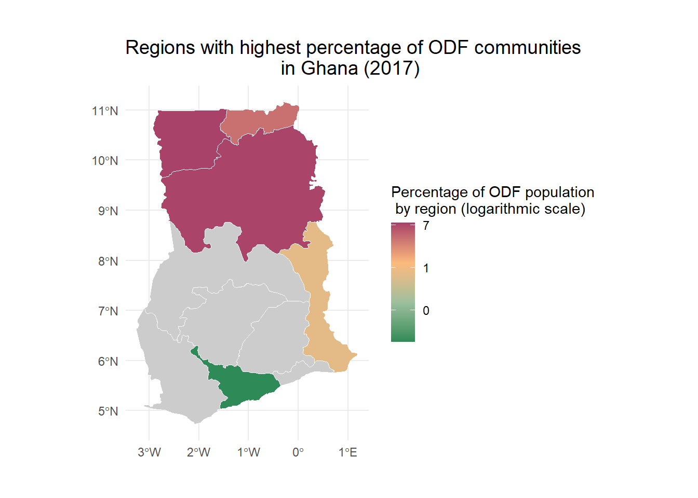

<!-- README.md is generated from README.Rmd. Please edit that file -->

# basisghana

<!-- badges: start -->

[](https://github.com/openwashdata/basisghana/actions/workflows/R-CMD-check.yaml)
[](https://zenodo.org/doi/10.5281/zenodo.10255444)
<!-- badges: end -->

This package compiles sanitation data from established Open Defecation
Free (ODF) communities across different regions in Ghana.



## Installation

You can install the development version of basisghana from
[GitHub](https://github.com/) with:

``` r
# install.packages("devtools")
devtools::install_github("openwashdata/basisghana")
```

Alternatively, you can download the individual dataset as a CSV or XLSX
file from the table below.

| dataset    | CSV                                                                                             | XLSX                                                                                              |
|:-----------|:------------------------------------------------------------------------------------------------|:--------------------------------------------------------------------------------------------------|
| basisghana | [Download CSV](https://github.com/openwashdata/basisghana/raw/main/inst/extdata/basisghana.csv) | [Download XLSX](https://github.com/openwashdata/basisghana/raw/main/inst/extdata/basisghana.xlsx) |
| ghanapop   | [Download CSV](https://github.com/openwashdata/basisghana/raw/main/inst/extdata/ghanapop.csv)   | [Download XLSX](https://github.com/openwashdata/basisghana/raw/main/inst/extdata/ghanapop.xlsx)   |

## Project goal

The primary goal of BaSIS (Basic Sanitation Information System) within
the context of implementing Community-Led Total Sanitation (CLTS) in
Ghana is to combat open defecation. By collecting data on communities
practicing open defecation, the project aims to shift away from previous
subsidy-based approaches and focus on community engagement. BaSIS seeks
to empower communities, particularly in regions like Upper West,
Eastern, Northern, Volta, and Central, to abandon open defecation
practices through CLTS. The objective is to break the cycle of
fecal-oral contamination, reduce the spread of diseases linked to poor
sanitation, and promote sustainable, community-driven solutions to
improve overall hygiene and sanitation practices.

## Data

The data set includes the locations of the existing open defecation free
(ODF) communities in various districts of Ghana. It was last updated in
September 2017.

The package provides access to two data sets.

``` r
library(basisghana)
```

The `basisghana` data set has 10 variables and 1618 observations. For an
overview of the variable names, see the following table.

``` r
basisghana
```

| variable_name | variable_type | description                                                                                                                               |
|:--------------|:--------------|:------------------------------------------------------------------------------------------------------------------------------------------|
| no            | integer       | A running id for unique for each region.                                                                                                  |
| region        | character     | First level of subnational government administration within the Republic of Ghana.                                                        |
| district      | character     | Second level administrative subdivision below region.                                                                                     |
| area_council  | character     | Third level administrative unit below district level.                                                                                     |
| community     | character     | Open defecation free (ODF) community. The community is the smallest level of local administration in Ghana (also called unit committees). |
| partner       | character     | Implementing partner of the CLTS (Community-Led Total Sanitation) program in the respective community.                                    |
| population    | double        | Population size of the respective community.                                                                                              |
| households    | double        | Number of households in the respective community.                                                                                         |
| toilets       | double        | Number of toilets in the respective community.                                                                                            |
| hwf           | double        | Number of handwashing facilities in the respective community.                                                                             |

The `ghanapop` data set has 9 variables and 260 observations. For an
overview of the variable names, see the following table.

``` r
ghanapop
```

| variable_name  | variable_type | description                                                                                        |
|:---------------|:--------------|:---------------------------------------------------------------------------------------------------|
| country_en     | character     | The English name denoting the country where the data was gathered (Ghana).                         |
| country_pcode  | character     | The ISO2 code representing Ghana (country of data collection).                                     |
| region_en      | character     | The English designation specifying the region within Ghana. (Ghana comprises 16 distinct regions.) |
| region_pcode   | character     | The postal code linked to the specific region.                                                     |
| district_en    | character     | The English name identifying the district in Ghana. (There are 261 districts in Ghana.)            |
| district_pcode | character     | The postal code specific to the district.                                                          |
| female_pop     | double        | Total female population within the corresponding District.                                         |
| male_pop       | double        | Total male population within the corresponding District.                                           |
| total_pop      | double        | Total population within the corresponding District.                                                |

## Example

### 1) Extracting the Top 10 Districts with the Highest Percentage of ODF Communities in Ghana

The following code demonstrates how to calculate the percentage of ODF
communities per region in Ghana. This computation involves using ODF
population data sourced from the basisghana dataset, in conjunction with
total population statistics categorized by region, sourced from the
ghanapop dataset.

``` r
library(tidyverse)
library(basisghana)
library(dplyr)


odf_by_district <- basisghana |> 
  group_by(district_en) |> 
  summarize(odf_population = sum(population, na.rm = TRUE)) 

odf_by_district <- merge(odf_by_district, ghanapop, by = 'district_en', all = TRUE) |> 
  mutate(percentage = round(odf_population / total_pop * 100, 2)) |> 
  arrange(desc(percentage)) 
  
top_10_odf <- odf_by_district |> 
  top_n(10, percentage) |> 
  select(district_en, region_en, percentage) |>
  mutate(percentage = paste0(percentage, "%")) |> 
  rename(
    district = "district_en",
    region = "region_en",
    `proportion ODF population in district` = "percentage"
  )

top_10_odf
#>                 district        region proportion ODF population in district
#> 1         Tatale Sanguli      Northern                                39.55%
#> 2                   Mion      Northern                                28.32%
#> 3              Chereponi Northern East                                25.87%
#> 4                Wa West    Upper West                                25.68%
#> 5   Daffiama Bussie Issa    Upper West                                24.93%
#> 6                   Garu    Upper East                                22.96%
#> 7                Zabzugu      Northern                                20.82%
#> 8  Bunkpurugu Nakpanduri Northern East                                20.79%
#> 9       Sawla-Tuna-Kalba      Savannah                                19.62%
#> 10               Binduri    Upper East                                18.86%
```

### 2) Mapping the Regions with highest percentage of ODF communities in Ghana

The code uses the dataset of ODF communities categorized by districts
(see above), which are then aggregated based on regions in Ghana. It’s
important to note that the reference to Ghana’s regions pertains to the
former 10 regions preceding the 2018 referendum, which subsequently led
to the establishment of new regions, resulting in a total of 16 regions
from 2020 (Refer to [Regions of
Ghana](https://en.wikipedia.org/wiki/Regions_of_Ghana)). From the
collected data across 5 of these former regions, a color-coded map of
Ghana depicts the varying proportions of Open Defecation Free (ODF)
communities in each region.

``` r
library(sf)
library(rnaturalearth)
library(ggplot2)

#group the regions according to how they were back in 2017 (10 regions instead of 16)
odf_by_region <- odf_by_district |> 
  mutate(region_en = case_when(
    region_en %in% c("Bono", "Bono East", "Ahafo") ~ "Brong Ahafo",
    region_en %in% c("Northern", "Savannah", "Northern East") ~ "Northern",
    region_en %in% c("Volta", "Oti") ~ "Volta",
    region_en %in% c("Western", "Western North") ~ "Western",
    TRUE ~ as.character(region_en)
  )) |> 
  group_by(region_en) |> 
     summarize(
    odf_population = sum(odf_population, na.rm = TRUE),
    female = sum(female_pop, na.rm = TRUE),  
    male = sum(male_pop, na.rm = TRUE), 
    total_pop = sum(total_pop, na.rm = TRUE)
  ) |> 
  mutate(percentage = round(odf_population / total_pop * 100, 2)) |> 
  arrange(desc(percentage)) |> 
  filter(!is.na(region_en)) |> 
  select(region_en, percentage)

ghana <- ne_states(country = "Ghana", returnclass = "sf") |> 
  rename(
    region_en = "name"
  )

ggplot() +
  theme_void() +
  geom_sf(data = full_join(ghana, odf_by_region, by = "region_en"), aes(fill = percentage), color = "white", lwd = 0) +
  scale_fill_gradientn(name = paste("Percentage of ODF population", "\n by region (logarithmic scale)"),
                       trans = "log",
                       labels = scales::label_number(accuracy = 1),
                       colors = c("#2E8B57","#9DBF9E", "#FCB97D", "#A84268"),
                       na.value = "grey80") +
  labs(title = paste("Regions with highest percentage of ODF communities", "\n                              in Ghana (2017)")) +
  theme_minimal() +
   theme(
    plot.title = element_text(size = 14),  
    plot.margin = margin(1, 1, 1, 1, "cm")  
  ) 
```


*Note: A logarithmic scale has been employed to accentuate distinctions
among lower percentage values.*

## License

Data are available as
[CC-BY](https://github.com/openwashdata/basisghana/LICENSE.md).

## Citation

To cite this package, please use:

``` r
citation("basisghana")
#> To cite package 'basisghana' in publications use:
#> 
#>   Schöbitz L, Skorik S (2023). "basisghana: Basic Sanitation
#>   Information System - BaSIS."
#> 
#> A BibTeX entry for LaTeX users is
#> 
#>   @Misc{schobitzskorik,
#>     title = {basisghana: Basic Sanitation Information System - BaSIS},
#>     author = {Lars Schöbitz and Sophia Skorik},
#>     year = {2023},
#>     abstract = {This package compiles sanitation data from established Open Defecation Free (ODF) communities across different regions in Ghana.},
#>     version = {0.0.0.9000},
#>   }
```
